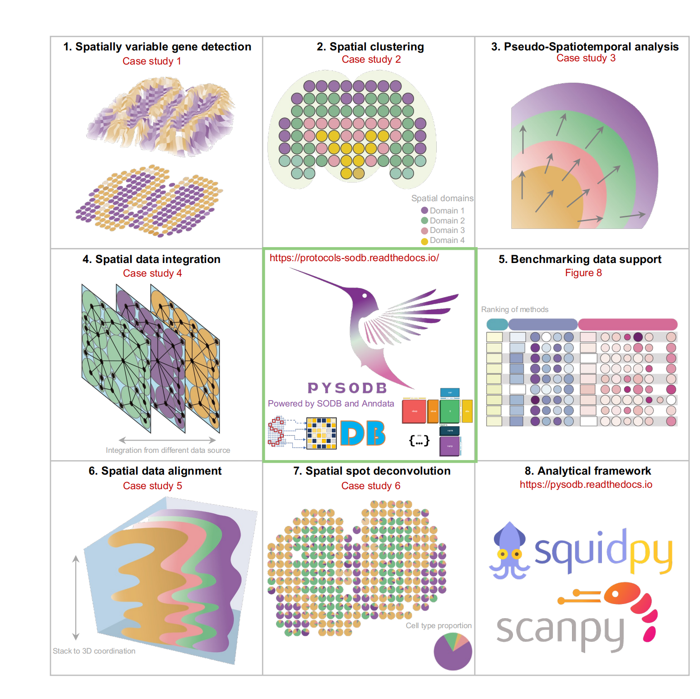

.. Protocols_SODB documentation master file, created by
   sphinx-quickstart on Mon Mar 20 07:51:41 2023.
   You can adapt this file completely to your liking, but it should at least
   contain the root `toctree` directive.

Protocols - Streamline development of spatial omics analysis tools using SODB!
===============================================================================

.. toctree::
   :maxdepth: 2
   :caption: Contents:

.. toctree::
   :maxdepth: 2
   :caption: Tutorial:

   SOView/SOView
   Spatially variable gene detection/Spatially variable gene detection
   Spatial clustering/Spatial clustering
   Pseudo-spatiotemporal analysis/Pseudo-spatiotemporal analysis
   Spatial data integration/Spatial data integration
   Spatial data alignment/Spatial data alignment
   Spatial spot deconvolution/Spatial spot deconvolution
   Generalizability to more spatial omics data/Generalizability to more spatial omics data

.. note:: Please consider citing following two papers in your publications if it helps your research.

   Yuan, Z., Pan, W., Zhao, X. et al. SOBD facilitates comprehensive exploration of spatial omics data. Nat Methods (2023). https://doi.org/10.1038/s41592-023-01773-7
   Lin, S., Zhao, F., Wu, Z. et al. Streamlining spatial omics data analysis with Pysodb. Nature Protocols (2023). https://doi.org/10.1038/s41596-023-00925-5

   
   
   
   
   

